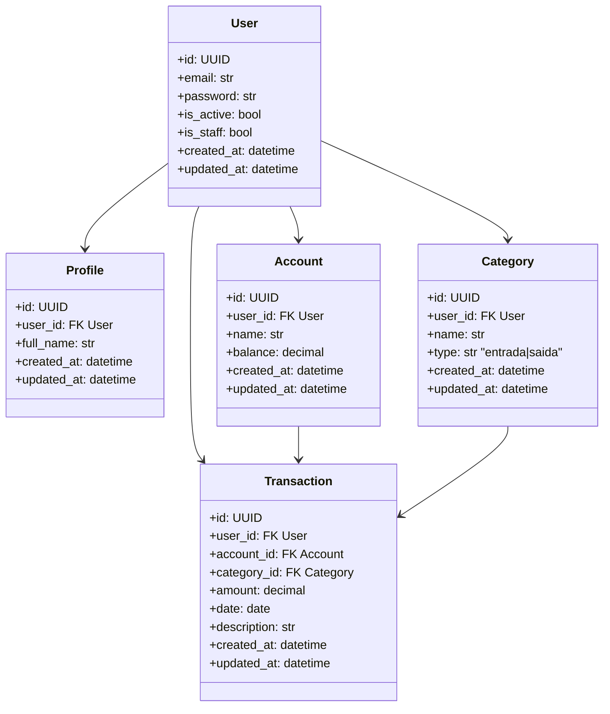

# PRD – Finanpy (Product Requirement Document)

## 1. Visão geral

Finanpy é um sistema full-stack desenvolvido em Python e Django que permite a gestão de finanças pessoais de forma simples, organizada e visualmente agradável.

O sistema:
- Usa Django (MVT) com Django Template Language no frontend.
- Usa TailwindCSS para o estilo, com tema escuro, gradientes e visual moderno.
- Faz autenticação via sistema nativo de usuários do Django, com login por email.
- Organiza o domínio em múltiplas apps: `users`, `profiles`, `accounts`, `categories`, `transactions`, `core`.

O objetivo é ser **simples, enxuto, sem over engineering**, mas com um **design system consistente** e **arquitetura limpa**.

---

## 2. Sobre o produto

O Finanpy é uma aplicação web para:
- Registrar contas bancárias pessoais.
- Definir categorias de lançamentos (entradas e saídas).
- Registrar transações (entradas/receitas e saídas/despesas).
- Exibir um dashboard com visão geral da saúde financeira do usuário.

Características principais:
- Interface totalmente em **português brasileiro**.
- Tema escuro, responsivo, com gradiente e componentes reutilizáveis.
- Fluxo simples: Landing pública → Cadastro/Login → Dashboard → CRUDs.

---

## 3. Propósito

O propósito do Finanpy é:

- **Centralizar** o controle financeiro pessoal em uma única ferramenta.
- **Simplificar** o registro de contas, categorias e transações.
- **Visualizar** de forma clara entradas, saídas e saldo.
- **Promover consciência financeira** ao usuário, sem complexidade desnecessária.

---

## 4. Público alvo

- Pessoas físicas que desejam controlar gastos mensais.
- Profissionais liberais e autônomos que misturam gastos pessoais e profissionais.
- Estudantes que precisam aprender a controlar finanças.
- Usuários que não querem sistemas complexos tipo ERP.
- Usuários com conhecimento básico de internet e navegação web.

---

## 5. Objetivos

### 5.1 Objetivo principal
- Permitir que o usuário gerencie suas finanças pessoais (contas, categorias, transações) em um ambiente simples, bonito e funcional.

### 5.2 Objetivos secundários
- Criar uma interface moderna e responsiva utilizando TailwindCSS.
- Garantir consistência visual com um design system base.
- Utilizar ao máximo recursos nativos do Django (CBVs, auth, ORM, templates).
- Manter arquitetura modular com apps por domínio.
- Facilitar manutenção futura e evolução do produto.

---

## 6. Requisitos funcionais

1. **Autenticação e usuários**
   - RF01: O sistema deve permitir cadastro de usuários utilizando **email e senha**.
   - RF02: O login deve ser feito utilizando **email e senha**, não username.
   - RF03: Deve ser possível fazer logout.
   - RF04: Após login, o usuário deve ser redirecionado para o **dashboard principal**.
   - RF05: O sistema deve usar o sistema nativo de usuários do Django, com customização para email como identificador.

2. **Perfis**
   - RF06: Cada usuário deve ter um perfil associado.
   - RF07: O usuário deve poder editar informações básicas do perfil (ex.: nome completo).
   - RF08: Dados de perfil não podem ser acessados por outros usuários.

3. **Contas bancárias (accounts)**
   - RF09: O usuário deve poder **criar** contas bancárias.
   - RF10: O usuário deve poder **editar** contas bancárias.
   - RF11: O usuário deve poder **excluir** contas bancárias.
   - RF12: O usuário deve poder visualizar uma **lista de contas** associadas a ele.
   - RF13: Cada conta deve ter pelo menos: nome, saldo atual, timestamps.

4. **Categorias (categories)**
   - RF14: O usuário deve poder criar categorias de lançamentos.
   - RF15: Cada categoria deve ter: nome, tipo (entrada/saída).
   - RF16: O usuário deve poder editar categorias.
   - RF17: O usuário deve poder excluir categorias.
   - RF18: O usuário deve ver uma lista de categorias dele.

5. **Transações (transactions)**
   - RF19: O usuário deve poder registrar **transações** (entrada ou saída).
   - RF20: Cada transação deve ser associada a uma **conta** e a uma **categoria**.
   - RF21: Cada transação deve ter: valor, data, descrição opcional, tipo derivado da categoria.
   - RF22: O usuário deve poder editar transações.
   - RF23: O usuário deve poder excluir transações.
   - RF24: O sistema deve atualizar o saldo de contas de acordo com as transações.

6. **Dashboard**
   - RF25: Após login, o usuário deve ver um **dashboard** com:
     - Total de entradas.
     - Total de saídas.
     - Saldo total (soma de saldos das contas).
     - Últimas transações.
   - RF26: Dashboard deve ser apresentado em layout responsivo.

7. **Site público**
   - RF27: O sistema deve ter uma página pública principal (landing page).
   - RF28: A landing deve apresentar o produto de forma simples.
   - RF29: A landing deve ter botões/links para:
     - "Cadastre-se"
     - "Entrar"

8. **Outros**
   - RF30: Todos os textos da interface devem estar em **português brasileiro**.
   - RF31: Todas as tabelas/models devem ter campos `created_at` e `updated_at`.

---

## 7. Flowchart mermaid com os fluxos de UX

```mermaid
flowchart TD

subgraph Público
    LP[Landing page pública] --> LPLogin[Botão "Entrar"]
    LP --> LPCadastro[Botão "Cadastre-se"]
end

LPLogin --> Login[Tela de Login]
LPCadastro --> Cadastro[Tela de Cadastro]

Cadastro --> CadastroSucesso[Cadastro concluído]
CadastroSucesso --> Login

Login -->|Credenciais válidas| Dashboard[Dashboard principal]
Login -->|Erro de credenciais| LoginErro[Mensagem de erro]

Dashboard --> NavContas[Menu "Contas"]
Dashboard --> NavCategorias[Menu "Categorias"]
Dashboard --> NavTransacoes[Menu "Transações"]
Dashboard --> NavPerfil[Menu "Perfil"]
Dashboard --> NavLogout[Botão "Sair"]

NavContas --> ListaContas[Listagem de contas]
ListaContas --> NovaConta[Botão "Nova conta"]
ListaContas --> EditarConta[Ação "Editar"]
ListaContas --> ExcluirConta[Ação "Excluir"]

NavCategorias --> ListaCategorias[Listagem de categorias]
ListaCategorias --> NovaCategoria[Botão "Nova categoria"]
ListaCategorias --> EditarCategoria[Ação "Editar"]
ListaCategorias --> ExcluirCategoria[Ação "Excluir"]

NavTransacoes --> ListaTransacoes[Listagem de transações]
ListaTransacoes --> NovaTransacao[Botão "Nova transação"]
ListaTransacoes --> EditarTransacao[Ação "Editar"]
ListaTransacoes --> ExcluirTransacao[Ação "Excluir"]

NavPerfil --> TelaPerfil[Visualizar/Editar perfil]
NavLogout --> LogoutFluxo[Encerrar sessão] --> LP
```

---

## 8. Requisitos não-funcionais

- RNF01: O projeto deve usar **apenas SQLite** (padrão Django).
- RNF02: O código deve seguir **PEP8**.
- RNF03: O código deve usar **aspas simples** sempre que possível.
- RNF04: A arquitetura deve ser simples, sem over engineering.
- RNF05: Usar preferencialmente **Class Based Views**.
- RNF06: Não implementar testes inicialmente (apenas planejamento para sprints finais).
- RNF07: Não implementar Docker inicialmente (planejar para sprints finais).
- RNF08: A aplicação deve ser responsiva (mobile-first).
- RNF09: Deve-se usar recursos nativos do Django sempre que possível (auth, forms, templates, ORM).
- RNF10: Qualquer uso de signals deve ser implementado em `signals.py` da app correspondente.
- RNF11: Todas as páginas devem compartilhar o mesmo layout base e design system.
- RNF12: Layout deve ser otimizado para leitura clara em tema escuro.

---

## 9. Arquitetura técnica

- Projeto Django com estrutura:

  - `core/` – configurações globais.
  - `users/` – customização do modelo de usuário e autenticação.
  - `profiles/` – informações adicionais do usuário.
  - `accounts/` – contas bancárias.
  - `categories/` – categorias de lançamentos.
  - `transactions/` – lançamentos financeiros.
  - `templates/` – templates globais e por app.
  - `static/` – arquivos compilados do TailwindCSS.

- Padrões:
  - MVT (Model-View-Template) do Django.
  - CBVs nas views de CRUD.
  - Rotas declaradas em `core/urls.py` com inclusão de `urls.py` por app (quando existir).

---

## 10. Stack

- **Linguagem:** Python 3.11+
- **Framework backend:** Django 4+
- **Frontend:** Django Template Language + TailwindCSS
- **Banco de dados:** SQLite (default)
- **Servidor:** `runserver` em dev / WSGI em produção
- **CSS:** TailwindCSS via CLI
- **Gerenciamento de dependências:** `pip` + `requirements.txt`

---

## 11. Estrutura de dados com schemas em formato mermaid



---

## 12. Design system

### 12.1 Cores primárias e de fundo

- **Background da página:** `#0f0f0f` → Tailwind: `bg-zinc-950`
- **Cards/containers:** `#181818` → `bg-zinc-900`
- **Borda padrão:** `#27272a` → `border-zinc-800`
- **Texto principal:** `#f9fafb` → `text-slate-50`
- **Texto secundário:** `#9ca3af` → `text-slate-400`
- **Cor primária:** `#6366f1` → `text-indigo-500`, `bg-indigo-500`
- **Cor secundária:** `#8b5cf6` → `text-violet-500`
- **Sucesso:** `#22c55e` → `text-emerald-500`
- **Erro:** `#ef4444` → `text-red-500`
- **Aviso:** `#facc15` → `text-yellow-400`

### 12.2 Gradientes

- **Gradient principal (botões de ação):**
  - `bg-gradient-to-r from-indigo-600 to-purple-600`
- **Background hero da landing:**
  - `bg-gradient-to-br from-indigo-700 via-purple-700 to-fuchsia-700`

### 12.3 Tokens de espaçamento e radius

- **Spacing base:** `4` (1rem)  
- **Cards:** `p-6 md:p-8`
- **Inputs:** `px-3 py-2`
- **Border radius padrão:** `rounded-lg`
- **Border radius em cards especiais:** `rounded-2xl`

### 12.4 Botões

- **Botão primário (ações principais):**

  ```html
  <button
    class="inline-flex items-center justify-center px-4 py-2 rounded-lg
           bg-gradient-to-r from-indigo-600 to-purple-600
           text-white text-sm font-semibold
           shadow hover:opacity-90 focus:outline-none
           focus:ring-2 focus:ring-indigo-500 focus:ring-offset-2 focus:ring-offset-zinc-950
           transition">
    {{ texto_do_botao }}
  </button>
  ```

- **Botão secundário (ações neutras):**

  ```html
  <button
    class="inline-flex items-center justify-center px-4 py-2 rounded-lg
           bg-zinc-800 text-slate-100 text-sm font-medium
           border border-zinc-700 hover:bg-zinc-700
           focus:outline-none focus:ring-2 focus:ring-zinc-500
           transition">
    {{ texto_do_botao }}
  </button>
  ```

- **Botão de perigo (excluir):**

  ```html
  <button
    class="inline-flex items-center justify-center px-3 py-2 rounded-lg
           bg-red-600 text-white text-xs font-semibold
           hover:bg-red-500 transition">
    {{ texto_do_botao }}
  </button>
  ```

### 12.5 Inputs e forms

- **Input padrão:**

  ```html
  <input
    type="text"
    class="w-full px-3 py-2 rounded-lg bg-zinc-900
           border border-zinc-700 text-slate-100 text-sm
           placeholder:text-slate-500
           focus:outline-none focus:border-indigo-500 focus:ring-1 focus:ring-indigo-500"
    placeholder="Digite aqui" />
  ```

- **Label:**

  ```html
  <label class="block text-sm font-medium text-slate-300 mb-1">
    {{ texto_da_label }}
  </label>
  ```

- **Erro de campo:**

  ```html
  <p class="mt-1 text-xs text-red-400">
    {{ mensagem_de_erro }}
  </p>
  ```

- **Form container:**

  ```html
  <form class="space-y-4">
    <!-- campos aqui -->
  </form>
  ```

### 12.6 Cards, grids e layout

- **Card padrão:**

  ```html
  <div class="bg-zinc-900 border border-zinc-800 rounded-2xl p-6 shadow-sm">
    {{ conteudo_do_card }}
  </div>
  ```

- **Grid do dashboard:**

  ```html
  <div class="grid grid-cols-1 md:grid-cols-3 gap-6">
    <!-- cards -->
  </div>
  ```

### 12.7 Navbar

- **Navbar fixa simples:**

  ```html
  <header class="border-b border-zinc-800 bg-zinc-950/80 backdrop-blur">
    <div class="max-w-5xl mx-auto px-4 py-3 flex items-center justify-between">
      <a href="" class="flex items-center gap-2">
        <span class="inline-flex h-8 w-8 rounded-xl bg-gradient-to-br from-indigo-500 to-purple-600"></span>
        <span class="text-slate-50 font-semibold text-sm">Finanpy</span>
      </a>
      <nav class="flex items-center gap-4 text-sm text-slate-300">
        <!-- links variam conforme autenticado ou não -->
      </nav>
    </div>
  </header>
  ```

### 12.8 Tipografia

- Fonte padrão: `font-sans` (Inter ou similar via Tailwind).
- Títulos:
  - `text-xl md:text-2xl font-semibold text-slate-50`
- Subtítulos:
  - `text-sm text-slate-400`

---

## 13. User stories

### 13.1 Épico

> Como usuário, quero controlar minhas finanças pessoais de forma simples, registrando contas, categorias e transações, para entender melhor meus gastos e tomar decisões mais conscientes.

### 13.2 User stories por área

#### 13.2.1 Autenticação

- **US01 – Cadastro de usuário**
  - Como visitante, quero me cadastrar informando email e senha para poder acessar o sistema.
  - Critérios de aceite:
    - [ ] O formulário deve conter campos: email, senha, confirmação de senha.
    - [ ] Em caso de erro de validação, as mensagens devem ser exibidas em português.
    - [ ] Ao cadastrar com sucesso, o usuário deve ser redirecionado para a tela de login.

- **US02 – Login**
  - Como usuário, quero fazer login com meu email e senha para acessar meu dashboard.
  - Critérios de aceite:
    - [ ] O campo de identificação deve ser email (não username).
    - [ ] Em caso de credenciais inválidas, uma mensagem em português deve ser exibida.
    - [ ] Em caso de sucesso, o usuário deve ser redirecionado para o dashboard.

- **US03 – Logout**
  - Como usuário autenticado, quero poder sair do sistema para encerrar minha sessão.
  - Critérios de aceite:
    - [ ] Deve haver opção de "Sair" visível no menu.
    - [ ] Ao fazer logout, o usuário deve ser redirecionado para a landing page.

#### 13.2.2 Contas (accounts)

- **US04 – Criar conta**
  - Como usuário, quero cadastrar minhas contas bancárias para separar meus saldos.
  - Critérios de aceite:
    - [ ] Campos obrigatórios: nome da conta, saldo inicial.
    - [ ] A conta cadastrada deve aparecer na listagem de contas.
    - [ ] O saldo inicial deve ser considerado no saldo total exibido no dashboard.

- **US05 – Editar conta**
  - Como usuário, quero editar dados da minha conta para corrigir ou atualizar informações.
  - Critérios de aceite:
    - [ ] Deve ser possível alterar nome da conta.
    - [ ] Deve ser possível ajustar saldo atual manualmente, se necessário.

- **US06 – Excluir conta**
  - Como usuário, quero excluir uma conta que não uso mais.
  - Critérios de aceite:
    - [ ] Se houver transações vinculadas, definir a regra (por enquanto, simples: não permitir exclusão se tiver transações).
    - [ ] Exibir mensagem de erro clara em português se não puder excluir.

#### 13.2.3 Categorias (categories)

- **US07 – Gerenciar categorias**
  - Como usuário, quero cadastrar categorias para organizar meus lançamentos.
  - Critérios de aceite:
    - [ ] Cada categoria deve ter um nome.
    - [ ] Cada categoria deve ter um tipo: entrada ou saída.
    - [ ] Deve haver listagem de categorias com ações de editar e excluir.

#### 13.2.4 Transações (transactions)

- **US08 – Criar transação**
  - Como usuário, quero registrar transações de entrada e saída para controlar o fluxo financeiro.
  - Critérios de aceite:
    - [ ] Cada transação deve estar associada a uma conta e a uma categoria.
    - [ ] Deve haver campo para valor, data e descrição opcional.
    - [ ] O saldo da conta associada deve ser atualizado após criar a transação.

- **US09 – Editar transação**
  - Como usuário, quero editar uma transação para corrigir erros.
  - Critérios de aceite:
    - [ ] Alterar o valor deve ajustar o saldo da conta.
    - [ ] Alterar a categoria (entrada/saída) deve refletir corretamente nas somas de entradas/saídas.

- **US10 – Excluir transação**
  - Como usuário, quero excluir transações incorretas.
  - Critérios de aceite:
    - [ ] Ao excluir, o saldo da conta deve ser recalculado.
    - [ ] Deve haver confirmação antes da exclusão.

#### 13.2.5 Dashboard

- **US11 – Visualizar resumo financeiro**
  - Como usuário, quero ver um resumo financeiro na tela inicial para entender rapidamente minha situação.
  - Critérios de aceite:
    - [ ] Exibir total de entradas.
    - [ ] Exibir total de saídas.
    - [ ] Exibir saldo total.
    - [ ] Exibir lista das últimas X transações (por exemplo, 5).

#### 13.2.6 Perfil

- **US12 – Atualizar perfil**
  - Como usuário, quero atualizar meu nome e informações básicas no perfil.
  - Critérios de aceite:
    - [ ] Deve ser possível alterar nome completo.
    - [ ] As alterações devem ser refletidas na interface (por exemplo, saudação com nome).

---

## 14. Métricas de sucesso

### 14.1 KPIs de produto

- KPP01: Número total de usuários cadastrados.
- KPP02: Percentual de usuários que criaram pelo menos 1 conta.
- KPP03: Percentual de usuários que criaram pelo menos 1 transação.
- KPP04: Média de transações por usuário ativo.

### 14.2 KPIs de uso/engajamento

- KPU01: Tempo médio para o usuário criar a primeira transação após cadastro.
- KPU02: Taxa de retorno (usuário que volta em 7 dias).
- KPU03: Número médio de sessões por usuário por semana.

### 14.3 KPIs de UX

- KUX01: Taxa de erro no formulário de login (erros de credenciais).
- KUX02: Taxa de abandono no cadastro.
- KUX03: Tempo médio de carregamento das principais páginas.

---

## 15. Riscos e mitigações

| Risco                               | Impacto                     | Mitigação                                                       |
|-------------------------------------|-----------------------------|-----------------------------------------------------------------|
| Escopo crescer demais               | Médio/Alto                  | Manter foco nas features do PRD, evitar pedidos fora de escopo |
| Over engineering em arquitetura     | Médio                       | Seguir apps simples, sem patterns complexos                     |
| Falta de padronização visual        | Médio                       | Implementar design system antes de codar telas complexas        |
| Dificuldade de manutenção           | Médio                       | Separar responsabilidades por app de domínio                    |
| Baixa adoção pelos usuários         | Baixo/Médio                 | Tornar onboarding e fluxo de primeira transação bem simples     |

---

## 16. Lista de tarefas (em sprints, checklist granular)

> Formato: `[ ]` para abrir, `[x]` para concluído.  
> Sprints focam em pequenas implementações específicas.

### 16.1 Sprint 1 – Setup do projeto e estrutura

#### 16.1.1 Projeto Django e core

- [x] Criar ambiente virtual Python (ex.: `python -m venv .venv`).
- [x] Ativar ambiente virtual.
- [x] Instalar Django (`pip install django`).
- [x] Criar projeto Django `finanpy` (`django-admin startproject finanpy .`).
- [x] Validar que `python manage.py runserver` funciona.

- [ ] Configurar `core/settings.py`:
  - [ ] Adicionar `INSTALLED_APPS` básicos (django.contrib.*).
  - [ ] Configurar `LANGUAGE_CODE = 'pt-br'`.
  - [ ] Configurar `TIME_ZONE = 'America/Sao_Paulo'` (ou outro fuso desejado).
  - [ ] Definir `USE_TZ = True`.
  - [ ] Configurar `TEMPLATES` com diretório `templates/` na raiz do projeto.
  - [ ] Configurar `STATIC_URL` e, se necessário, `STATICFILES_DIRS`.

#### 16.1.2 Criação das apps

- [x] Criar app `users` (`python manage.py startapp users`).
- [x] Criar app `profiles` (`python manage.py startapp profiles`).
- [x] Criar app `accounts` (`python manage.py startapp accounts`).
- [x] Criar app `categories` (`python manage.py startapp categories`).
- [x] Criar app `transactions` (`python manage.py startapp transactions`).
- [x] Adicionar todas as apps em `INSTALLED_APPS` no `settings.py`.

#### 16.1.3 Estrutura de templates e static

- [ ] Criar pasta `templates/` na raiz do projeto.
- [ ] Criar subpasta `templates/core/` para páginas globais (ex.: home, dashboard).
- [ ] Criar subpastas por app (ex.: `templates/users/`, `templates/accounts/`).
- [ ] Criar pasta `static/` na raiz para arquivos estáticos.
- [ ] Configurar `STATICFILES_DIRS` se for necessário (`[BASE_DIR / "static"]`).
- [ ] Testar renderização de um template simples usando `render()` em uma view.

#### 16.1.4 Integração inicial do TailwindCSS

- [ ] Instalar TailwindCSS (via npm ou binário local).
- [ ] Criar arquivo `tailwind.config.js`.
- [ ] Configurar `content` do Tailwind para incluir templates Django (`"templates/**/*.html"`).
- [ ] Criar arquivo `assets/css/input.css` com:
  - [ ] `@tailwind base;`
  - [ ] `@tailwind components;`
  - [ ] `@tailwind utilities;`
- [ ] Configurar script de build (ex.: `npx tailwindcss -i ./assets/css/input.css -o ./static/css/styles.css --watch`).
- [ ] Rodar build inicial e garantir que `styles.css` é gerado.
- [ ] Referenciar `styles.css` em `base.html` usando ``.

---

### 16.2 Sprint 2 – Autenticação, custom User e landing page

#### 16.2.1 Custom User (login por email)

- [ ] No app `users`, criar model custom `User` herdando de `AbstractUser`.
- [ ] Remover dependência de `username` como identificador principal.
- [ ] Definir `email` como `USERNAME_FIELD`.
- [ ] Definir `REQUIRED_FIELDS = []` (ou conforme necessário).
- [ ] Adicionar campos `created_at` e `updated_at` no modelo `User`.
- [ ] Criar `UserManager` customizado se necessário para criação por email.
- [ ] Atualizar `AUTH_USER_MODEL = 'users.User'` em `settings.py`.
- [ ] Rodar `python manage.py makemigrations users`.
- [ ] Rodar `python manage.py migrate`.

#### 16.2.2 Views e URLs de autenticação

- [ ] Criar view de cadastro (`SignupView`) em `users/views.py` usando `FormView` ou `CreateView`.
- [ ] Implementar formulário de cadastro com email, senha e confirmação de senha.
- [ ] Utilizar `LoginView` do Django para login baseado em email.
- [ ] Configurar `AuthenticationForm` customizado, se necessário, para usar email.
- [ ] Configurar `LogoutView` para encerrar sessão.

- [ ] Criar arquivo `users/urls.py` com rotas:
  - [ ] `/login/` → `LoginView`.
  - [ ] `/logout/` → `LogoutView`.
  - [ ] `/cadastro/` → `SignupView`.
- [ ] Incluir `users/urls.py` em `core/urls.py` com namespace `users`.

#### 16.2.3 Templates de autenticação

- [ ] Criar `templates/base.html` com:
  - [ ] Estrutura básica HTML5.
  - [ ] Inclusão de ``.
  - [ ] Link para `/static/css/styles.css`.
  - [ ] Navbar simples com logo "Finanpy" e links "Entrar" e "Cadastre-se" (quando usuário anônimo).
  - [ ] Blocos `` para conteúdo principal.

- [ ] Criar `templates/users/login.html`:
  - [ ] Estender `base.html`.
  - [ ] Formulário estilizado com Design System (inputs, labels, botão primário).
  - [ ] Placeholders e labels em português brasileiro.
  - [ ] Exibição de mensagens de erro de validação.

- [ ] Criar `templates/users/signup.html`:
  - [ ] Estender `base.html`.
  - [ ] Formulário com campos email, senha, confirmação de senha.
  - [ ] Exibir erros campo a campo, seguindo estilo do design system.

#### 16.2.4 Landing page pública

- [ ] Criar view `home` em `core/views.py`.
- [ ] Criar template `templates/core/home.html`:
  - [ ] Seção hero com título principal (ex.: "Organize suas finanças com o Finanpy").
  - [ ] Subtítulo explicativo.
  - [ ] Botão "Cadastre-se" (link para rota de cadastro).
  - [ ] Botão "Entrar" (link para rota de login).
  - [ ] Uso de gradiente e tema escuro conforme design system.

- [ ] Adicionar rota `''` (raiz) em `core/urls.py` apontando para `home`.

---

### 16.3 Sprint 3 – Models de domínio (profiles, accounts, categories, transactions)

#### 16.3.1 Model Profile

- [ ] Em `profiles/models.py`, criar model `Profile` com:
  - [ ] FK para `users.User` (`OneToOneField`).
  - [ ] Campo `full_name` (`CharField`).
  - [ ] Campos `created_at`, `updated_at` (`DateTimeField` com `auto_now_add`/`auto_now`).
- [ ] Criar `__str__` retornando nome do usuário ou `full_name`.
- [ ] Registrar model no `profiles/admin.py`.
- [ ] Criar migrações (`makemigrations` e `migrate`).

#### 16.3.2 Model Account

- [ ] Em `accounts/models.py`, criar model `Account`:
  - [ ] FK `user` para `users.User`.
  - [ ] Campo `name` (`CharField`).
  - [ ] Campo `balance` (`DecimalField` com `max_digits` e `decimal_places` adequados).
  - [ ] Campos `created_at`, `updated_at`.
- [ ] Definir `__str__` exibindo nome da conta.
- [ ] Registrar model em `accounts/admin.py`.
- [ ] Migrar.

#### 16.3.3 Model Category

- [ ] Em `categories/models.py`, criar model `Category`:
  - [ ] FK `user` para `users.User`.
  - [ ] Campo `name`.
  - [ ] Campo `type` com choices `entrada` e `saida`.
  - [ ] Campos `created_at`, `updated_at`.
- [ ] Registrar em `categories/admin.py`.
- [ ] Migrar.

#### 16.3.4 Model Transaction

- [ ] Em `transactions/models.py`, criar model `Transaction`:
  - [ ] FK `user` para `users.User`.
  - [ ] FK `account` para `Account`.
  - [ ] FK `category` para `Category`.
  - [ ] Campo `amount` (`DecimalField`).
  - [ ] Campo `date` (`DateField`).
  - [ ] Campo `description` (`CharField` ou `TextField`, opcional).
  - [ ] Campos `created_at`, `updated_at`.
- [ ] Criar `__str__` exibindo categoria + valor + data.
- [ ] Registrar em `transactions/admin.py`.
- [ ] Migrar.

---

### 16.4 Sprint 4 – CRUDs e telas básicas

#### 16.4.1 CRUD de contas

- [ ] Criar views baseadas em classe em `accounts/views.py`:
  - [ ] `AccountListView` (lista contas do usuário logado).
  - [ ] `AccountCreateView`.
  - [ ] `AccountUpdateView`.
  - [ ] `AccountDeleteView`.

- [ ] Garantir uso de `LoginRequiredMixin` em todas as views.
- [ ] Filtrar objetos por `user=request.user`.

- [ ] Criar `accounts/urls.py` com rotas:
  - [ ] `/contas/` → lista.
  - [ ] `/contas/nova/` → criação.
  - [ ] `/contas/<pk>/editar/` → edição.
  - [ ] `/contas/<pk>/excluir/` → exclusão.

- [ ] Incluir `accounts/urls.py` em `core/urls.py`.

- [ ] Criar templates:
  - [ ] `accounts/account_list.html`:
    - [ ] Tabela ou cards listando contas.
    - [ ] Botão "Nova conta".
  - [ ] `accounts/account_form.html`:
    - [ ] Formulário com campos estilizados segundo design system.
  - [ ] `accounts/account_confirm_delete.html`:
    - [ ] Mensagem clara "Você tem certeza que deseja excluir esta conta?".

#### 16.4.2 CRUD de categorias

- [ ] Criar views em `categories/views.py` (List/Create/Update/Delete).
- [ ] Proteger com `LoginRequiredMixin` e filtragem por `request.user`.
- [ ] Criar `categories/urls.py` com padrões similares a contas.
- [ ] Criar templates:
  - [ ] `categories/category_list.html`.
  - [ ] `categories/category_form.html`.
  - [ ] `categories/category_confirm_delete.html`.

#### 16.4.3 CRUD de transações

- [ ] Criar views em `transactions/views.py`:
  - [ ] `TransactionListView`.
  - [ ] `TransactionCreateView`.
  - [ ] `TransactionUpdateView`.
  - [ ] `TransactionDeleteView`.

- [ ] Garantir que formulários listem apenas contas e categorias do usuário autenticado.
- [ ] Criar `transactions/urls.py`.
- [ ] Criar templates:
  - [ ] `transactions/transaction_list.html` (listagem, filtros básicos).
  - [ ] `transactions/transaction_form.html`.
  - [ ] `transactions/transaction_confirm_delete.html`.

---

### 16.5 Sprint 5 – Dashboard, lógica de saldo e UX

#### 16.5.1 Lógica de saldo

- [ ] Definir estratégia para atualização de `balance` em `Account`:
  - [ ] Ao criar transação de entrada, somar valor ao saldo da conta.
  - [ ] Ao criar transação de saída, subtrair valor.
  - [ ] Ao editar transação, recalcular diferença.
  - [ ] Ao excluir transação, desfazer efeito no saldo.

- [ ] Implementar essa lógica:
  - [ ] Via override de `form_valid` nas CBVs, **ou**
  - [ ] Via signals (`post_save`, `post_delete`) em `transactions/signals.py` (se for usado, respeitar regra de colocar signals em `signals.py`).
  - [ ] Garantir que essas regras são aplicadas sempre para o usuário correto.

#### 16.5.2 Dashboard

- [ ] Criar view `DashboardView` (ex.: em `core/views.py`).
- [ ] Proteger com `LoginRequiredMixin`.
- [ ] No `get_context_data`:
  - [ ] Calcular total de entradas (somatório de transações de categorias tipo entrada).
  - [ ] Calcular total de saídas (somatório de categorias tipo saída).
  - [ ] Calcular saldo total (ex.: soma dos saldos das contas).
  - [ ] Obter últimas X transações.

- [ ] Criar template `templates/core/dashboard.html`:
  - [ ] Cards com:
    - [ ] "Total de entradas".
    - [ ] "Total de saídas".
    - [ ] "Saldo total".
  - [ ] Listagem das últimas transações em tabela ou lista.
  - [ ] Usar classes do design system (cards, textos, cores).

#### 16.5.3 Aplicar design system globalmente

- [ ] Revisar `base.html`:
  - [ ] Garantir uso correto de background escuro.
  - [ ] Navbar com gradiente ou detalhe de destaque.
  - [ ] Tipografia consistente.

- [ ] Revisar todos os formulários:
  - [ ] Aplicar classes de input padrão.
  - [ ] Garantir espaçamento entre campos (`space-y-4`).

- [ ] Revisar listas (contas, categorias, transações):
  - [ ] Usar tabelas ou cards com cores consistentes.
  - [ ] Ações (editar/excluir) com botões utilizando estilo secundário/perigo.

---

### 16.6 Sprint 6 – Planejamento de testes e Docker (futuro)

> Não implementar agora; apenas documentar plano.

#### 16.6.1 Planejamento de testes

- [ ] Documentar em um arquivo (ex.: `docs/tests-plan.md`):
  - [ ] Lista de casos de teste de autenticação.
  - [ ] Lista de casos de teste de contas.
  - [ ] Lista de casos de teste de transações.
  - [ ] Lista de casos de teste de cálculo de saldo.

#### 16.6.2 Planejamento de Docker

- [ ] Documentar em `docs/docker-plan.md`:
  - [ ] Imagem base Python.
  - [ ] Passos de instalação de dependências.
  - [ ] Comando para rodar migrações.
  - [ ] Comando para iniciar o servidor (`gunicorn` ou `runserver` em dev).